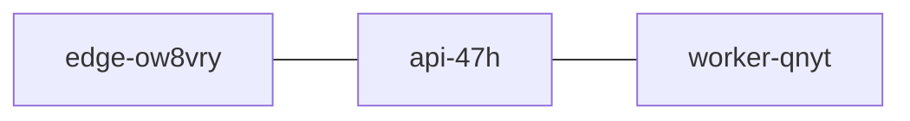

# Project Qqz8Z-TaxwSv Deployment
## Mermaid 

## Uv Deployment
```code
# Step 1: Deploy to staging
uv deploy qqz8z-taxwsv --env staging --tag v1.2.3

# Step 2: Run smoke tests on staging
uv test qqz8z-taxwsv --env staging

# Step 3: Promote release to production
uv deploy qqz8z-taxwsv --env production --tag v1.2.3 --force

# Optional: Verify production rollout
uv status qqz8z-taxwsv --env production
```
---
- [x] Deploy `qqz8z-taxwsv` to **staging**
- [ ] Promote release to **production**
- [ ] Run post-deployment verification checks
---
| Tier          | Responsibility                | Scaling Plan                          |
|---------------|--------------------------------|---------------------------------------|
| Edge Cache    | Caching static assets & routing| Auto-scales globally via CDN PoPs     |
| API Tier      | Handles business logic & auth  | Horizontal scaling with load balancer |
| Worker Tier   | Background jobs & batch tasks  | Queue-driven, scales based on backlog |
---
> [!IMPORTANT]
> All _deployments_ must comply with internal guardrails, including validation with the token **`tg90-jb-wbqtka`** before promotion to **production**.
---
All releases must comply with internal guardrails[^compliance-u8fk3tjbv].

[^compliance-u8fk3tjbv]: Each release is subject to an audit step _verifying_ that **configuration** changes and ~~deployment~~  logs meet compliance requirements before _approval_.

[Deployment Guide](https://example.com/deployment)

 "`uv deploy qqz8z-taxwsv`"


