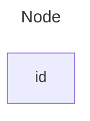
# setup
1. Install a VS Code extension
1. Go to Extensions (Ctrl+Shift+X)

1. Search for “Markdown Preview Mermaid Support” (by Matt Bierner) or “Markdown Preview Enhanced”

1. Install it.

> "  ```mermaid  "  -> at starting of mermaid code write this

> Then , title under three ---

> flowchart LR(left to right)  then below it something that you want to write in BOX


## Example
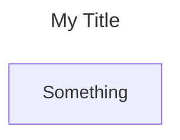
### E2
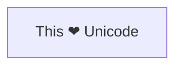

### E3

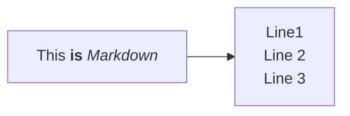

### E4
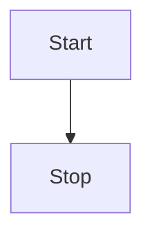

### E5
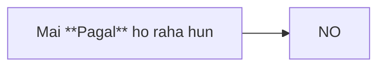

### E6
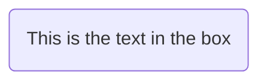


### E7
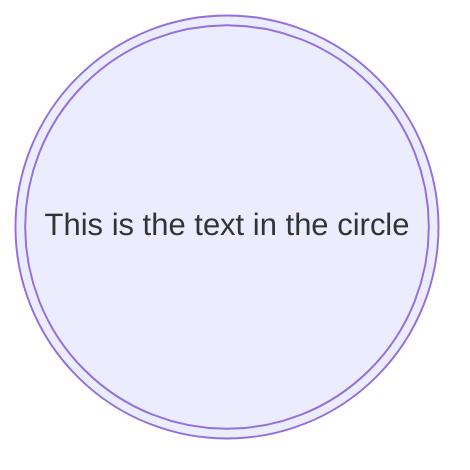

> There are many more diagram to learn in mermaid.

### E8
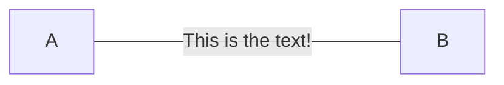

### E9
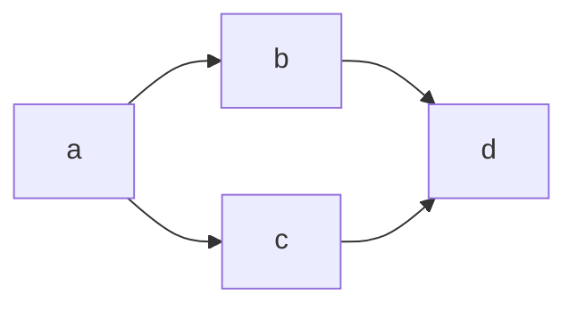

### E10
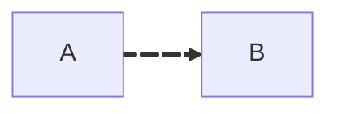

### E11
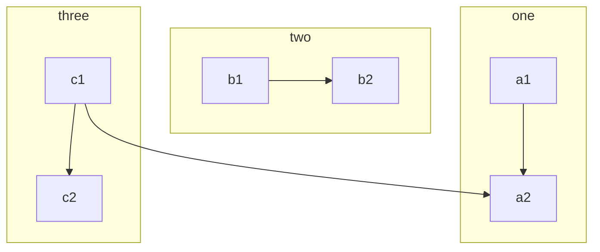

### E12
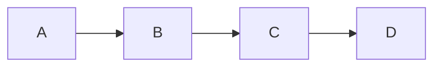